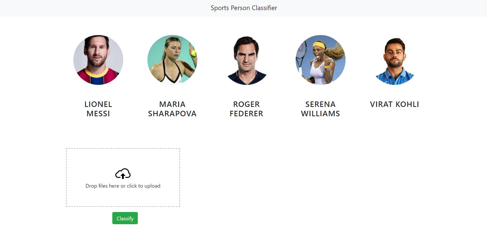

# CelebrityFaceRecognition

I developed this project that allows users to classify images that they add into the interface. I trained a custom machine learning model, built a Flask server around it, and created a user interface for ease of use.

## Steps that I have gone through

1. Image Scraping
2. Using OpenCV for face and eye detection
3. Data cleaning using OpenCV and Numpy
4. Feature engineering using Wavelet transformation
5. Model Building using Support Vector Machines, Logistic Regression, and Random Forests
6. Using GridSearchCV for fine tuning the model
7. Exporting the model
8. Writing a Flask server around it
9. Built the UI using HTML, CSS, JavaScript, and JQuery

We have only done our classification based on 5 people:

1. Maria Sharapova
2. Serena Williams
3. Virat Kohli
4. Roger Federer
5. Lionel Messi

## Folder Structure

- ui : Contains the code of UI in HTML, CSS and JavaScript
- server : Python Flask Server
- model : Contains the notebook for buiding the ML model and images that I used to train the model
- UIsnapshots : Contains snapshots of the UI

## Technologies Used

1. Python
2. Numpy and OpenCV for data cleaning
3. Sklearn for model building
4. Matplotlib and Seaborn for data visualization
5. IDEs - Jupyter Notebook, Pycharm, and Visual Studio Code
6. Python Flask for HTTP server
7. UI - HTML/CSS/JavaScript
8. Fatkun Batch Download extension was used for image scraping
# BangaloreHomePricePrediction
